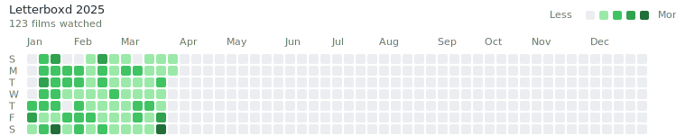

# Letterboxd Contribution Graph



This repository contains a GitHub Action that generates a GitHub-style contribution graph from your Letterboxd film diary.

## How It Works

1. The action automatically runs daily to fetch your latest Letterboxd activity
2. It scrapes your public Letterboxd diary page for film entries
3. Generates a contribution graph similar to GitHub's, showing your film watching activity
4. Commits the updated SVG to the repository

## Usage

### Using this action in your own repository

1. Create a new repository or use an existing one
2. Create the workflow file at `.github/workflows/update-graph.yml`:

```yaml
coming soon
