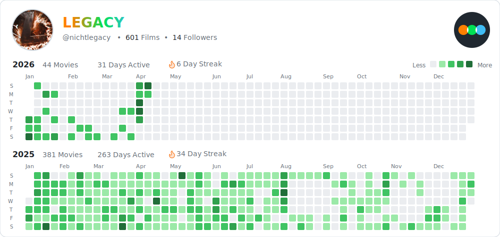

# Letterboxd Contribution Graph

[](https://github.com/nichtlegacy/letterboxd-graph/actions/workflows/update-graph-simple.yml)
[](https://github.com/nichtlegacy/letterboxd-graph/releases/latest)


Generates a GitHub-style contribution graph from your Letterboxd film diary.

<picture>
  <source
    media="(prefers-color-scheme: dark)"
    srcset="images/github-letterboxd-dark.svg"
  />
  <source
    media="(prefers-color-scheme: light)"
    srcset="images/github-letterboxd-light.svg"
  />
  
</picture>

Transform your Letterboxd film-watching history into a beautiful contribution graph, updated daily via GitHub Actions. Perfect for showcasing your cinematic journey in your GitHub profile README!

## Features

- Fetches your public Letterboxd diary entries.
- Creates SVG graphs in light and dark themes with embedded profile images and the Letterboxd logo.
- Customizable year, week start, and output paths.
- Automatic daily updates via GitHub Actions.
- **Hover Support**: Hover over a cell to display additional information about the films watched on that specific day. (Visible only when the image is opened in a browser).


## Usage

### GitHub Action

Set up the action in your repository to generate your Letterboxd graph automatically.

```yaml
name: Update Letterboxd Contribution Graph
on:
  schedule:
    - cron: "0 0 * * *"
  workflow_dispatch:
permissions:
  contents: write
jobs:
  update-graph:
    runs-on: ubuntu-latest
    steps:
      - uses: actions/checkout@v4
      - uses: actions/setup-node@v4
        with:
          node-version: '18'
          cache: 'npm'
      - run: npm ci
      - run: npm start nichtlegacy -o images/github-letterboxd
      - run: |
          git config --global user.name 'github-actions[bot]'
          git config --global user.email 'github-actions[bot]@users.noreply.github.com'
          git add images/github-letterboxd-dark.svg images/github-letterboxd-light.svg
          git commit --allow-empty -m "Update Letterboxd graph"
          git push
```

#### Setup Steps

1. **Fork This Repository** (Recommended):
   - Click "Fork" at the top-right to create a copy under your GitHub account.

2. **Update the Username**:
   - Open `.github/workflows/update-letterboxd.yml`.
   - Replace `nichtlegacy` with your Letterboxd username:
     ```yaml
     run: npm start nichtlegacy -o images/github-letterboxd
     ```

3. **Enable GitHub Actions**:
   - Go to the "Actions" tab in your forked repository and enable workflows if prompted.

4. **Customize (Optional)**:
   - Add options to the `npm start` command:
     - `-y YEAR`: Specify a year (e.g., `-y 2023`).
     - `-w monday`: Start weeks on Monday (default: `sunday`).
     - `-o PATH`: Change the output path (e.g., `-o dist/my-graph`).
     Example:
     ```yaml
     run: npm start nichtlegacy -y 2023 -w monday -o dist/letterboxd
     ```

5. **Run the Action**:
   - Wait for the daily run (midnight UTC) or trigger it manually via the "Actions" tab.

#### Dark Mode Support

To display your graph with theme switching in your README:

```html
<picture>
  <source media="(prefers-color-scheme: dark)" srcset="images/github-letterboxd-dark.svg" />
  <source media="(prefers-color-scheme: light)" srcset="images/github-letterboxd-light.svg" />
  
</picture>
```

Add this to your `README.md` and commit it to show off your graph!

### Alternative: New Repository

If you prefer a fresh setup:

1. Create a new repository on GitHub.
2. Clone it locally:
   ```bash
   git clone https://github.com/nichtlegacy/letterboxd-graph.git
   cd letterboxd-graph
   ```
3. Copy the files from this repo (`standalone.js`, `package.json`, `package-lock.json`, `.github/workflows/update-letterboxd.yml`).
4. Update the workflow file with your username (see above).
5. Push the changes:
   ```bash
   git add .
   git commit -m "Setup Letterboxd contribution graph"
   git push
   ```

### Local Usage

Test the graph generation on your machine:

```bash
# Clone the repo
git clone https://github.com/nichtlegacy/letterboxd-graph.git
cd letterboxd-graph

# Install dependencies
npm install

# Generate the graph
npm start nichtlegacy
```

The SVGs will be saved to `images/`. Customize with flags like `-y 2023` or `-w monday`.

## Prerequisites

- A public Letterboxd profile with diary entries.
- Node.js v18+ (for local use).
- GitHub account with Actions enabled.

## Contributing

Ideas or improvements? Open an issue or submit a pull request!

## License

MIT License - see [LICENSE](LICENSE) for details.