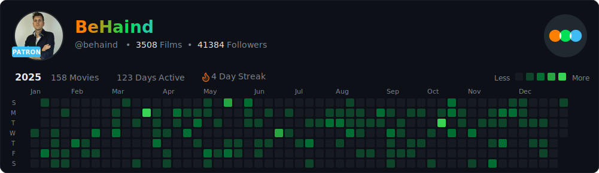
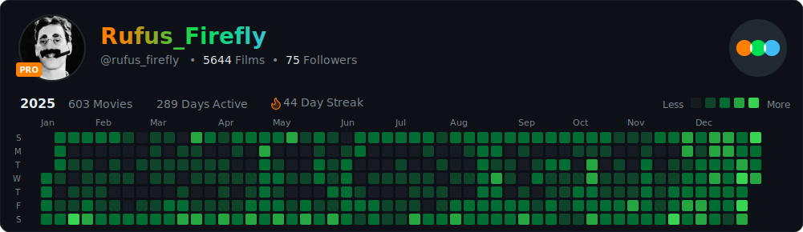
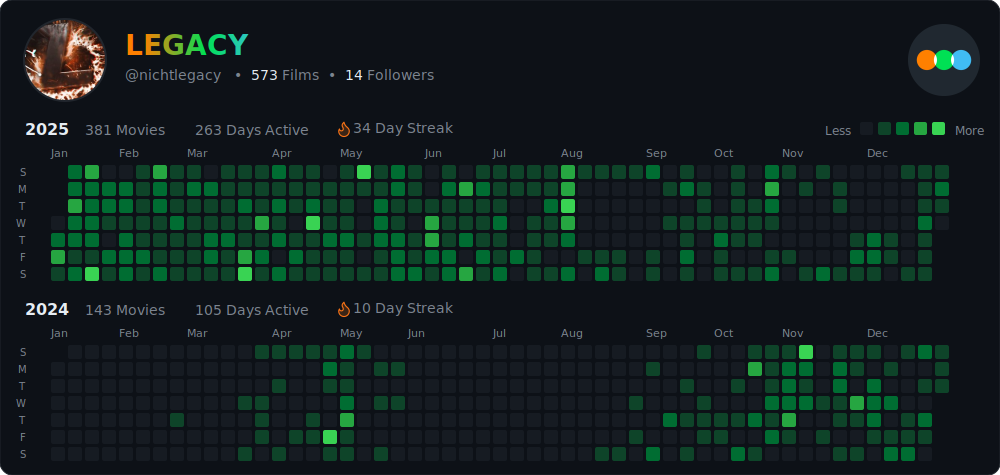
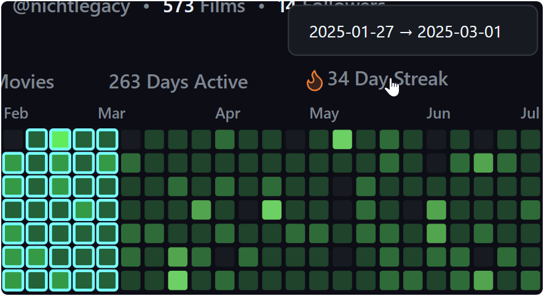
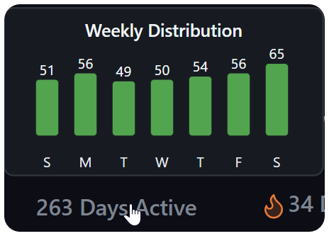
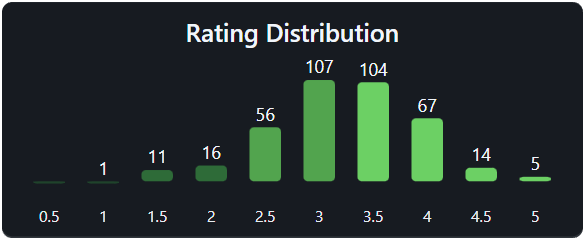

# 🎬 Letterboxd Contribution Graph

<p align="center">
  
  
  
  
  
</p>

<p align="center">
  <strong>Transform your Letterboxd film diary into a beautiful GitHub-style contribution graph</strong>
</p>

<p align="center">
  <a href="https://letterboxd.com/nichtlegacy/" target="_blank">
    <picture>
      <source media="(prefers-color-scheme: dark)" srcset="https://github.com/nichtlegacy/letterboxd-graph/blob/main/images/github-letterboxd-dark.svg">
      <source media="(prefers-color-scheme: light)" srcset="https://github.com/nichtlegacy/letterboxd-graph/blob/main/images/github-letterboxd-light.svg">
      
    </picture>
  </a>
</p>

---

## ✨ Features

| Feature | Description |
|---------|-------------|
| 🎨 **Light & Dark Themes** | Automatically adapts to GitHub's theme preference |
| 📊 **Activity Heatmap** | GitHub-style contribution graph showing film activity |
| 👤 **Profile Integration** | Shows profile picture, display name, stats, and member badge |
| 🏆 **Pro/Patron Badges** | Displays Letterboxd Pro (orange) or Patron (cyan) status |
| 📅 **Multi-Year Support** | Generate graphs spanning multiple years |
| 🎯 **Streak Highlighting** | Hover over "Day Streak" to highlight your longest streak |
| 💬 **Interactive Tooltips** | Hover over cells to see film details (in browser) |
| ⭐ **Rating Mode** | Color cells by average rating instead of watch count |
| 🔄 **Daily Updates** | Automated updates via GitHub Actions |

---

## 🚀 Quick Start

### 1. Fork this Repository

Click the **Fork** button at the top-right of this page.

### 2. Update Your Username

Edit `.github/workflows/update-graph.yml`:

```yaml
- run: npm start YOUR_LETTERBOXD_USERNAME -o images/github-letterboxd
```

### 3. Enable GitHub Actions

Go to **Actions** tab → Enable workflows if prompted.

### 4. Run the Workflow

The graph updates daily at midnight UTC, or trigger manually via the **Actions** tab.

---

## 📸 Examples

### Patron User (Single Year)
<p align="center">
  
</p>

### Pro User (Single Year)
<p align="center">
  
</p>

### Multi-Year Graph
<p align="center">
  
</p>

### Interactive Features

Hover over stats to reveal additional information (visible when opening the SVG in a browser):

<table>
  <tr>
    <th>Day Streak Highlight</th>
    <th>Days Active Tooltip</th>
    <th>Film Count Tooltip</th>
  </tr>
  <tr>
    <td></td>
    <td></td>
    <td></td>
  </tr>
</table>

---

## 📖 CLI Usage

```bash
# Install dependencies
npm install

# Basic usage
node src/cli.js <username>

# With options
node src/cli.js <username> [options]
```

### Arguments

| Flag | Description | Default |
|------|-------------|---------|
| `-y <years>` | Year(s) to generate, comma-separated (e.g. `2024,2023`) | Current year |
| `-w <day>` | Week start: `sunday` or `monday` | `sunday` |
| `-o <path>` | Output path (without extension) | `images/github-letterboxd` |
| `-g <bool>` | Enable username gradient: `true` or `false` | `true` |
| `-p` | Export PNG files in addition to SVG | Disabled |
| `-m <mode>` | Graph mode: `count` or `rating` | `count` |

### Examples

```bash
# Single year with custom output
node src/cli.js nichtlegacy -y 2025 -o images/my-graph

# Multiple years (2024 + 2025)
node src/cli.js nichtlegacy -y 2025,2024

# Start week on Monday, no gradient
node src/cli.js nichtlegacy -w monday -g false

# Rating mode with PNG export
node src/cli.js nichtlegacy -m rating -p
```

---

## 🔧 GitHub Actions Setup

### Workflow File

Create `.github/workflows/update-graph.yml`:

```yaml
name: Update Letterboxd Graph

# ╔════════════════════════════════════════════════════════════════╗
# ║  CONFIGURATION - Edit these values for your Letterboxd profile ║
# ╚════════════════════════════════════════════════════════════════╝
env:
  LETTERBOXD_USERNAME: "YOUR_USERNAME" # Replace with your username
  YEARS: ""                            # e.g. "2025,2024" or leave empty for current year
  EXPORT_PNG: "false"                  # Set to "true" to also generate PNG files
  WEEK_START: "sunday"                 # "sunday" or "monday"
  GRADIENT: "true"                     # "true" for colored name, "false" for white

on:
  schedule:
    - cron: "0 0 * * *"   # Daily at midnight UTC
  workflow_dispatch:       # Manual trigger

permissions:
  contents: write

jobs:
  update-graph:
    runs-on: ubuntu-latest
    steps:
      - uses: actions/checkout@v4
      
      - uses: actions/setup-node@v4
        with:
          node-version: '20'
          cache: 'npm'
      
      - run: npm ci
      
      - name: Generate Graph
        run: |
          # Build command based on configuration
          CMD="npm start ${{ env.LETTERBOXD_USERNAME }} -o images/github-letterboxd"
          
          if [ -n "${{ env.YEARS }}" ]; then CMD="$CMD -y ${{ env.YEARS }}"; fi
          if [ "${{ env.WEEK_START }}" = "monday" ]; then CMD="$CMD -w monday"; fi
          if [ "${{ env.GRADIENT }}" = "false" ]; then CMD="$CMD -g false"; fi
          if [ "${{ env.EXPORT_PNG }}" = "true" ]; then CMD="$CMD -p"; fi
          
          echo "Running: $CMD"
          eval $CMD

      - name: Commit and Push
        run: |
          git config --global user.name 'github-actions[bot]'
          git config --global user.email 'github-actions[bot]@users.noreply.github.com'
          git add images/
          
          if git diff --staged --quiet; then
            echo "No changes to commit"
          else
            git commit -m "Update Letterboxd graph"
            git push
          fi
```

### Configuration

You can customize the graph directly in the workflow file by editing the `env` section at the top:

- **LETTERBOXD_USERNAME**: Your Letterboxd profile name
- **YEARS**: Comma-separated list of years (e.g., `2025,2024`)
- **EXPORT_PNG**: Set to `true` if you want PNG versions alongside SVGs
- **WEEK_START**: Start week on `sunday` or `monday`
- **GRADIENT**: Toggle the username text gradient

---

## 📂 Project Structure

```
letterboxd-graph/
├── .github/
│   ├── assets/               # README images and examples
│   └── workflows/
│       └── update-graph.yml  # GitHub Actions workflow
├── fonts/
│   ├── Inter-Bold.ttf
│   ├── Inter-Medium.ttf
│   ├── Inter-Regular.ttf
│   └── Inter-SemiBold.ttf    # Primary font for text measurement
├── images/
│   ├── github-letterboxd-dark.svg    # Generated dark theme
│   └── github-letterboxd-light.svg   # Generated light theme
├── src/
│   ├── cli.js                # CLI entry point
│   ├── fetcher.js            # Letterboxd data fetching
│   ├── generator.js          # SVG generation
│   ├── stats.js              # Statistics calculations
│   └── exporter.js           # PNG export functionality
├── package.json
└── README.md
```

---

## 🖼️ Embed in Your README

Add this to your profile README to display the graph with automatic theme switching:

```html
<p align="center">
  <a href="https://letterboxd.com/YOUR_LETTERBOXD_USERNAME/" target="_blank">
    <picture>
      <source
        media="(prefers-color-scheme: dark)"
        srcset="https://github.com/YOUR_GITHUB_USERNAME/letterboxd-graph/blob/main/images/github-letterboxd-dark.svg"
      />
      <source
        media="(prefers-color-scheme: light)"
        srcset="https://github.com/YOUR_GITHUB_USERNAME/letterboxd-graph/blob/main/images/github-letterboxd-light.svg"
      />
      
    </picture>
  </a>
</p>
```

Replace `YOUR_GITHUB_USERNAME` and `YOUR_LETTERBOXD_USERNAME` with your usernames.

---

## 🎨 Themes & Modes

### Graph Modes

| Mode | Description |
|------|-------------|
| **Count** (default) | Cell color intensity based on number of films watched |
| **Rating** | Cell color based on average rating of films that day |

### Member Badges

The graph automatically detects and displays your Letterboxd membership status:

| Status | Badge Color | Location |
|--------|-------------|----------|
| **Pro** | Orange (#ff8000) | Bottom-left of profile picture |
| **Patron** | Cyan (#40bcf4) | Bottom-left of profile picture |

---

## 🛠️ Requirements

- **Node.js** v18 or higher
- **Public Letterboxd profile** with diary entries
- **GitHub account** with Actions enabled (for automated updates)

---

## 🤝 Contributing

Contributions are welcome! Feel free to:

- 🐛 Report bugs
- 💡 Suggest features
- 🔧 Submit pull requests

---

## 📄 License

MIT License - see [LICENSE](LICENSE) for details.
