<div align="center">

# Letterboxd Graph

**Turn your Letterboxd diary into a contribution graph and shareable cards.**<br>
Runs as a GitHub Action, commits the finished SVGs back to your repository.

[](https://github.com/nichtlegacy/letterboxd-graph/actions)
[](https://github.com/nichtlegacy/letterboxd-graph/releases)
[](https://nodejs.org/)
[](#quick-start)
[](./LICENSE)

<p>
  
  
  
</p>

[Quick Start](#quick-start) • [What It Generates](#what-it-generates) • [Configuration](#configuration) • [CLI](#cli) • [How It Works](#how-it-works) • [Pages Site](#pages-site) • [License](#license)

<a href="https://letterboxd.nichtlegacy.com/images/github-letterboxd-dark.svg" title="Open the complete graph SVG">
  <picture>
    <source media="(prefers-color-scheme: dark)" srcset="https://raw.githubusercontent.com/nichtlegacy/letterboxd-graph/main/images/github-letterboxd-dark.svg">
    <source media="(prefers-color-scheme: light)" srcset="https://raw.githubusercontent.com/nichtlegacy/letterboxd-graph/main/images/github-letterboxd-light.svg">
    
  </picture>
</a>

</div>

## Overview

Letterboxd Graph reads a public Letterboxd diary and renders it as SVG: a
GitHub-style activity calendar, a review card per year and per month, and a card
for the profile itself. It also writes a JSON export and a CSV diary so you can
build your own widgets from the same figures, plus small shields-style badges
for a profile README.

It is meant to be embedded — in a GitHub profile README, a blog post, or a
social preview. Everything is a self-contained SVG with the fonts subset and
inlined, so there is nothing to host and nothing to load at view time.

It needs no Letterboxd account, API key, or server. It reads public profile
pages only, and cannot see anything your profile does not show a logged-out
visitor.

## Quick Start

Add one workflow file to any repository. No fork, no copied scripts.

```yaml
# .github/workflows/letterboxd.yml
name: Update Letterboxd Graph

on:
  schedule:
    - cron: "0 0 * * *"   # daily at midnight UTC
  workflow_dispatch:

permissions:
  contents: write

jobs:
  update-graph:
    runs-on: ubuntu-latest
    steps:
      - uses: actions/checkout@v4

      - uses: nichtlegacy/letterboxd-graph@v2
        with:
          username: YOUR_LETTERBOXD_USERNAME
          years: "last 2"           # this year and last, defaults to the current year
```

Run it once from the **Actions** tab. A healthy first run logs the diary pages
it fetched, then commits into `images/`:

```
Found 599 film entries, 456 in 2026, 2025
   Posters: 10/10, favourites 4/4
   ✓ images/github-letterboxd-dark.svg
   ✓ images/letterboxd-review-2026-dark.svg
   ✓ images/letterboxd-review-current-month-dark.svg
   ✓ images/letterboxd-profile-dark.svg
```

`actions/checkout` is required so the action has a repository to write into. To
handle the files yourself instead of committing them, set `commit: 'false'`.

## What It Generates

Every run writes the same set of files into `images/`, each in a dark and a
light variant. Use `<picture>` so GitHub serves the one matching the reader's
theme — see [Embedding](#embedding).

### Contribution Graph

`github-letterboxd-{dark,light}.svg` — the activity calendar, one block of weeks
per requested year.

<p align="center">
  <a href="https://letterboxd.nichtlegacy.com/images/github-letterboxd-dark.svg" title="Open the complete graph SVG">
    <picture>
      <source media="(prefers-color-scheme: dark)" srcset="images/github-letterboxd-dark.svg">
      <source media="(prefers-color-scheme: light)" srcset="images/github-letterboxd-light.svg">
      
    </picture>
  </a>
</p>

Hovering reveals more than the graph shows at rest:

| Hover target | Reveals |
|--------------|---------|
| Year label | Films grouped by release decade |
| Film count | Rating distribution, average rating, rewatch and like totals |
| Days Active | Weekday distribution |
| Day Streak | Date range, film count, and the streak highlighted in the grid |
| Any day cell | The films watched, `↻` for rewatches and `♥` for likes |

<table>
  <tr>
    <th>Day Streak Highlight</th>
    <th>Days Active Tooltip</th>
    <th>Film Count Tooltip</th>
  </tr>
  <tr>
    <td>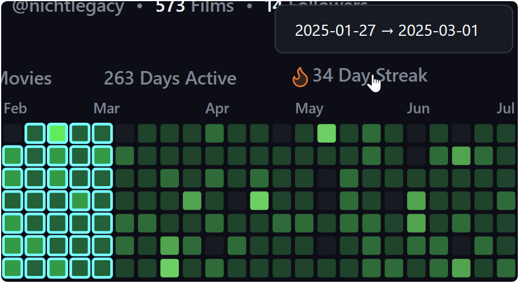</td>
    <td>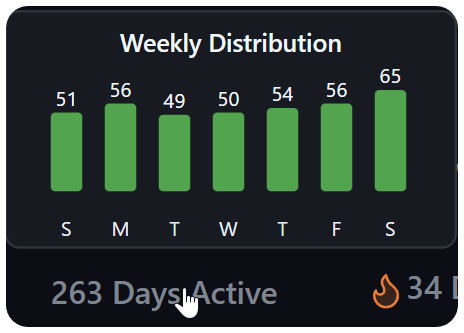</td>
    <td>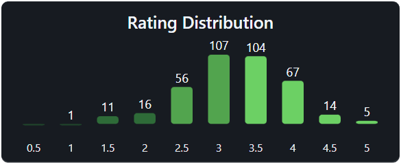</td>
  </tr>
</table>

> [!NOTE]
> GitHub embeds SVGs through an `` tag, which receives no mouse events, and
> serves raw files with a `sandbox` CSP, so hover states and links are dead in a
> README. They work on the [Pages site](#pages-site), which embeds each card as
> an `<object>`. The cell reveal animation is declarative CSS and *does* play
> inside a README.

### Year in Review

`letterboxd-review-<year>-{dark,light}.svg` — one card per year in `review-years`.

<p align="center">
  <a href="https://letterboxd.nichtlegacy.com/images/letterboxd-review-2026-dark.svg" title="Open the complete year card SVG">
    <picture>
      <source media="(prefers-color-scheme: dark)" srcset="images/letterboxd-review-2026-dark.svg">
      <source media="(prefers-color-scheme: light)" srcset="images/letterboxd-review-2026-light.svg">
      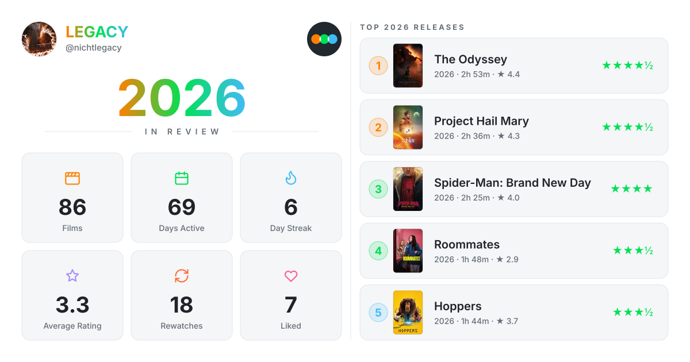
    </picture>
  </a>
</p>

1200×630, the Open Graph default, so it works as a social preview as it stands.
Headline figures on the left, top rated films on the right with poster art,
runtime and the Letterboxd community rating.

What the list ranks is a choice, because "the best I saw in 2026" and "the best
of 2026" are different claims:

| `top-films` | The list holds |
|-------------|----------------|
| `watched` (default) | Everything watched that year, whatever year it came out |
| `released` | Only the films released that year |

It applies to year cards only. A month is far too small a window to also demand
the film came out that year — one month of new releases is a handful of titles
at best and often none, so a month card always ranks everything watched.

The card above is set to `released`, which is why it carries a **TOP 2026
RELEASES** heading. The default needs no heading — everything watched is not a
restriction, so there is nothing to announce. The heading takes its space out of
the rows rather than off the bottom, so both columns end on the same line either
way.

<details>
<summary><b><code>top-films: watched</code></b> — the default, for comparison</summary>

<p align="center">
  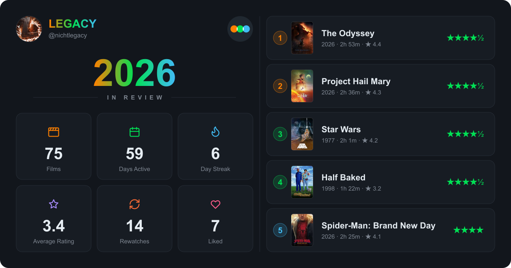
</p>

Same year, same diary. A five star film from 1977 outranks everything released
that year, which is true but says nothing about the year itself.

</details>

### Month in Review

`letterboxd-review-current-month-{dark,light}.svg` and
`letterboxd-review-previous-month-{dark,light}.svg`.

<p align="center">
  <a href="https://letterboxd.nichtlegacy.com/images/letterboxd-review-previous-month-dark.svg" title="Open the complete month card SVG">
    <picture>
      <source media="(prefers-color-scheme: dark)" srcset="images/letterboxd-review-previous-month-dark.svg">
      <source media="(prefers-color-scheme: light)" srcset="images/letterboxd-review-previous-month-light.svg">
      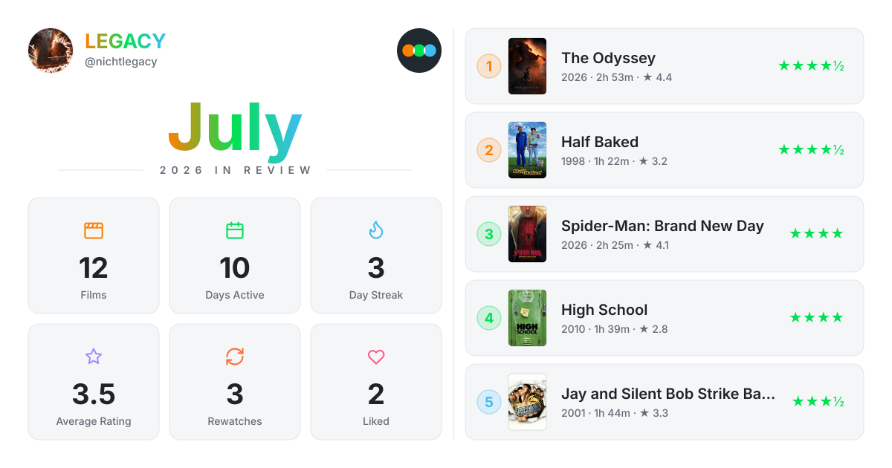
    </picture>
  </a>
</p>

The same card narrowed to a single month. A month with nothing logged says so
rather than rendering an empty list.

Its film list always ranks everything watched that month, whatever
[`top-films`](#year-in-review) is set to.

The files are named by how recent the month is, not by its date, so an embed
keeps working when the month turns over and old cards do not pile up.

### Profile Card

`letterboxd-profile-{dark,light}.svg` — not tied to a year.

<p align="center">
  <a href="https://letterboxd.nichtlegacy.com/images/letterboxd-profile-dark.svg" title="Open the complete profile card SVG">
    <picture>
      <source media="(prefers-color-scheme: dark)" srcset="images/letterboxd-profile-dark.svg">
      <source media="(prefers-color-scheme: light)" srcset="images/letterboxd-profile-light.svg">
      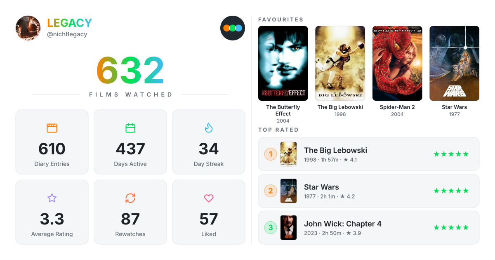
    </picture>
  </a>
</p>

The headline is your all-time films watched, taken from the profile page. The
right column shows the favourites pinned on your Letterboxd profile. What the
figures below it cover depends on [Diary Scope](#diary-scope).

### Member Badges

Pro and Patron members get their badge over the avatar, on the graph and on both
cards.

| Status | Badge color | Placement |
|--------|-------------|-----------|
| **Patron** | Cyan `#40bcf4` | Bottom-left of the profile picture |
| **Pro** | Orange `#ff8000` | Bottom-left of the profile picture |

<details>
<summary><b>Patron example</b> — <a href="https://letterboxd.com/BeHaind/">@BeHaind</a></summary>

<p align="center">
  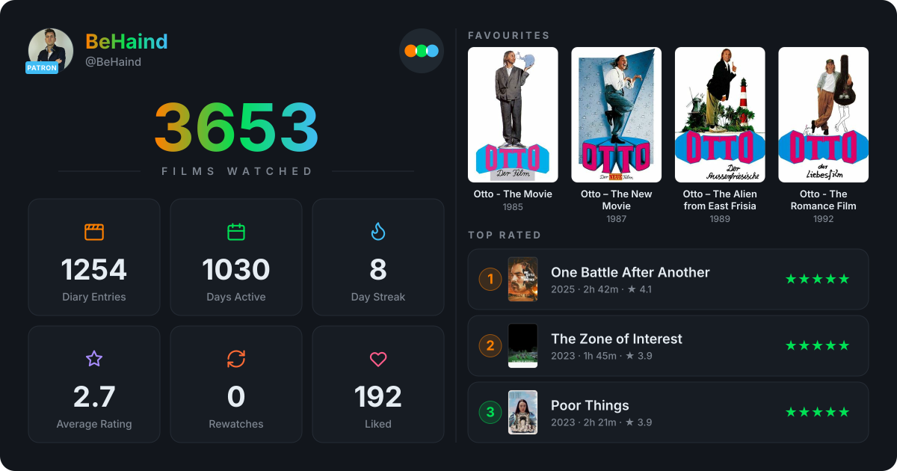
</p>
<p align="center">
  
</p>

</details>

<details>
<summary><b>Pro example</b> — <a href="https://letterboxd.com/Rufus_Firefly/">@Rufus_Firefly</a></summary>

<p align="center">
  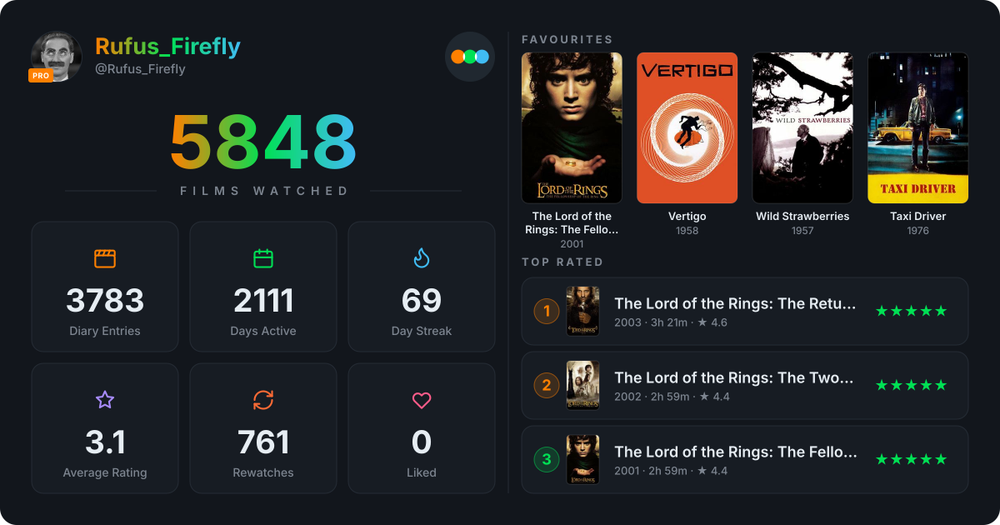
</p>
<p align="center">
  
</p>

</details>

### Mini Badges

`badge-{films,rating,streak,days,liked,rewatches}.svg` — small shields-style
badges for a profile README. One SVG per stat, no dark/light split, so the same
file works on both GitHub themes.

<p align="center">
  
  
  
  
</p>

They are generated from the all-time figures (`buildAllTimeStats` in
`src/stats.js:288`), not just the graph years, so a badge stays the same
whether the graph shows one year or three.

| Stat | Badge label | Value | Color |
|------|-------------|-------|-------|
| `films` | `films` | diary entries | green `#00e054` |
| `days` | `days active` | unique days with films | blue `#40bcf4` |
| `streak` | `day streak` | longest consecutive run | orange `#ff8000` |
| `rating` | `avg rating` | average of rated entries | orange `#ff8000` |
| `liked` | `liked` | liked entries | pink `#ff5c8a` |
| `rewatches` | `rewatches` | repeat viewings | purple `#a78bfa` |

| Style | Height | Look |
|-------|--------|------|
| `dot` (default) | 20px | pill with the three Letterboxd dots on the left |
| `pill` | 20px | 1px border, accent dot — like the site's filter chips |
| `card` | 20px | same as pill with radius 4, like a KPI tile |
| `flat` | 20px | two-tone, no border — normal GitHub form in site palette |
| `flat-square` | 20px | square, no outer radius |
| `for-the-badge` | 28px | big uppercase |
| `plastic` | 20px | flat with light top highlight |

Embed one badge (use the raw URL, not the `blob` URL):

```md


```

Or all at once:

```md


```

Configuration is action inputs, CLI flags or the `.github/workflows/update-graph.yml` env block:

```yaml
# action
- uses: nichtlegacy/letterboxd-graph@v2
  with:
    username: YOUR_LETTERBOXD_USERNAME
    badge-style: "dot"                          # pill | card | dot | flat | flat-square | for-the-badge | plastic
    badge-stats: "films,rating,streak,days"     # any of films,days,streak,rating,liked,rewatches
```

```bash
# CLI
node src/cli.js nichtlegacy --badge-style dot --badge-stats films,rating,streak,days
```

Badges are committed to `images/` like the cards. Change `badge-stats` later and a stale badge file is removed on the next run.

<details>
<summary><b>All badges in all styles</b></summary>

<p align="center">
  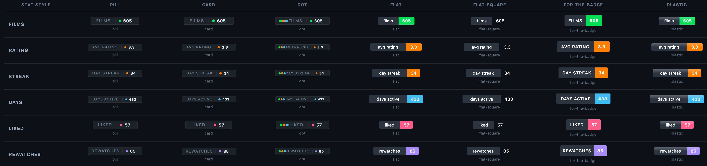
</p>

All 6 stats × 7 styles at a glance (`films` 605 · `rating` 3.3 · `streak` 34 · `days` 433 · `liked` 57 · `rewatches` 85). `dot` is the default. Each badge is `badgeSvg(label,value,{style})` from `src/badge.js:99`.

</details>

### JSON & CSV Export

`letterboxd-data.json` — every figure the cards use, for building your own
widgets. `letterboxd-diary.csv` — one row per diary entry, newest first, for
spreadsheets and ad-hoc analysis. See [JSON Export](#json-export-1) below.

## Configuration

All options are action inputs. Only `username` is required.

| Input | Description | Default |
|-------|-------------|---------|
| `username` | Letterboxd username (**required**) | – |
| `years` | Contribution graph years: `last N` or a list like `2026,2025` | current year |
| `review-years` | Year cards: `all`, `last N`, or a list like `2026,2025`; `all` uses every year in the fetched diary | `all` |
| `scope` | Diary scope: `all` or `years` | `all` |
| `month-cards` | Recent months to also make cards for, `0` to skip | `2` |
| `top-films` | Year card film list: `watched` or `released` | `watched` |
| `mode` | Cell coloring: `count` or `rating` | `count` |
| `week-start` | `sunday` or `monday` | `sunday` |
| `gradient` | Gradient text: `true`, `false`, `name` or `year` | `true` |
| `animate` | Cell reveal animation | `true` |
| `export-png` | Also write PNG files | `false` |
| `badge-style` | Badge style: `dot` (default), `pill`, `card`, `flat`, `flat-square`, `for-the-badge`, `plastic` | `dot` |
| `badge-stats` | Comma-separated badge stats: `films`, `rating`, `streak`, `days`, `liked`, `rewatches` | `films,rating,streak,days` |
| `output` | Output path without extension | `images/github-letterboxd` |
| `commit` | Commit and push the generated files | `true` |
| `commit-message` | Commit message (branch and UTC timestamp appended) | `Update Letterboxd graph` |
| `node-version` | Node.js version | `22.12` |
| `install-browser-deps` | Install Puppeteer system libraries (Ubuntu runners) | `true` |

Outputs `svg-dark`, `svg-light` and `data-json` carry the paths written, for
chaining into an upload or deploy step.

`years` controls the contribution graph. `last 2` is read as *this year and last*
on the day the run happens, so the graph rolls over on its own; a pinned
`2026,2025` keeps drawing 2025 all through 2027, and nothing in the run looks
wrong while it does. `review-years` controls the year cards independently. Its
default `all` creates one card for every year present in the fetched diary, while
a list or `last N` limits the cards deliberately. Cards for a year that drops out
of the selection are deleted on the next run.

<details>
<summary><b>Alternative: fork and run the CLI directly</b></summary>

To own the whole workflow instead, fork this repository and edit
`.github/workflows/update-graph.yml`. Its `env` block is the configuration:

```yaml
env:
  LETTERBOXD_USERNAME: "YOUR_USERNAME"
  YEARS: "last 2"                      # this year and last, or a list like "2026,2025"
  REVIEW_YEARS: "all"                  # every year in the fetched diary, or a selection
  SCOPE: "all"                         # "all" reads the whole diary — needed for all-time figures
  MONTH_CARDS: "2"                     # this month and last month, 0 to skip
  TOP_FILMS: "watched"                 # year cards rank "released" that year or everything "watched"
  MODE: "count"                        # cell colour: "count" of films or average "rating"
  WEEK_START: "sunday"                 # "sunday" or "monday"
  GRADIENT: "true"                     # "true" for colored name, "false" for white
  ANIMATE: "true"                      # "false" to disable the cell reveal animation
  EXPORT_PNG: "false"                  # "true" to also generate PNG files
  BADGE_STYLE: "dot"                   # pill | card | dot | flat | flat-square | for-the-badge | plastic
  BADGE_STATS: "films,rating,streak,days"   # any of films,rating,streak,days,liked,rewatches
```

This is the path this repository uses itself, except that it calls the action
through `uses: ./` so every scheduled run doubles as an end-to-end test of what
external consumers get.

</details>

## CLI

```bash
npm install
node src/cli.js <username> [options]
```

| Flag | Description | Default |
|------|-------------|---------|
| `-y <years>` | Contribution graph years: `last N` or a list like `2026,2025` | current year |
| `--review-years <years>` | Year cards: `all`, `last N`, or a list like `2026,2025` | all |
| `-s <scope>` | Diary scope: `all` or `years` | `all` |
| `-c <count>` | Recent months to also card, `0` to skip | `2` |
| `-r <scope>` | Year card film list: `watched` or `released` | `watched` |
| `-m <mode>` | Graph mode: `count` or `rating` | `count` |
| `-w <day>` | Week start: `sunday` or `monday` | `sunday` |
| `-g <targets>` | Gradient text: `true`, `false`, `name` or `year` | `true` |
| `-a <bool>` | Cell reveal animation | `true` |
| `-p` | Also export PNG files | off |
| `--badge-style <style>` | Badge style: `dot` (default), `pill`, `card`, `flat`, `flat-square`, `for-the-badge`, `plastic` | `dot` |
| `--badge-stats <list>` | Badge stats: `films`, `rating`, `streak`, `days`, `liked`, `rewatches` | `films,rating,streak,days` |
| `-o <path>` | Output path without extension | `images/github-letterboxd` |

```bash
# Two graph years, cards for every year in the diary
node src/cli.js nichtlegacy -y 2026,2025 --review-years all

# Only the requested year, no month cards
node src/cli.js nichtlegacy -y 2025 -s years -c 0

# Only that year's releases in the card list
node src/cli.js nichtlegacy -y 2025 -r released

# Rating mode, week starting Monday, plain text, with PNGs
node src/cli.js nichtlegacy -m rating -w monday -g false -p

# Badges: plastic style, only films + streak + days active
node src/cli.js nichtlegacy --badge-style plastic --badge-stats films,streak,days
```

## How It Works

### Diary Scope

By default the complete diary is fetched, so the profile card can report
all-time figures. Paginating it costs one request per 50 entries:

| Profile | Films watched | Diary entries | Requests |
|---------|---------------|---------------|----------|
| [@nichtlegacy](https://letterboxd.com/nichtlegacy/) | 626 | 599 | 12 |
| [@BeHaind](https://letterboxd.com/BeHaind/) | 3,653 | 1,254 | 26 |
| [@Rufus_Firefly](https://letterboxd.com/Rufus_Firefly/) | 5,848 | 3,783 | 76 |

The two counts differ because they measure different things:

- **Films watched** is the profile's own figure, linking to `/<user>/films/`. It
  counts every film marked watched, whether or not it was ever given a date.
- **Diary entries** are dated log entries. Only these carry a rating, a rewatch
  flag or a like, so everything on the cards below the headline comes from them.

@BeHaind has 3,653 films watched against 1,253 distinct films in the diary, so
roughly two thirds were ticked off without a diary entry. Only the diary drives
the request count, which is why a large library can still be cheap to fetch.

### Rewatches

A viewing counts as a rewatch if Letterboxd's flag is set **or** the same film
appears earlier in the diary. Neither signal alone is enough:

- The flag is set by hand, so a repeat logged without ticking it is missed. On
  [@nichtlegacy](https://letterboxd.com/nichtlegacy/) that is 30 of 83 rewatches.
- Repeats alone miss a film first seen before the diary begins, which has only
  one entry in it. On [@Rufus_Firefly](https://letterboxd.com/Rufus_Firefly/)
  that is 761 viewings — every rewatch they have.

Films are identified by the slug in their diary link, not by title. Titles are
not unique, and neither is title plus year: two different 2023 films are both
called *Leo*. @Rufus_Firefly has 55 titles that are actually different films, so
matching on the title alone would invent rewatches and merge unrelated films in
the [ranking](#film-ranking).

The graph covers the years in `years`; year cards cover `review-years`. Under the
default `scope: all`, both are filtered from the same complete fetch rather than
requested again. Set `scope: years` to fetch only the graph years — cheaper on a
large diary, but it leaves the profile card and `review-years: all` scoped to the
years that were fetched.

### Film Ranking

Films on the cards are ranked by rating first. Likes and rewatches only decide
the order *within* a rating:

```
score = rating + 0.30 if liked + 0.08 per extra viewing, capped at 0.16
```

The bonuses total less than a half-star step, so a film can never overtake one
rated higher. This matters more than it sounds: a typical year has a handful of
films at the top rating and a dozen tied one step below, so without it the last
slots would be filled in whatever order the diary returned. Repeat viewings of
one film merge into a single entry at its best rating.

### Graph Modes

**`count`** — intensity from how many films you watched that day, scaled to your
busiest day. The legend reads *Less* to *More*.

<p align="center">
  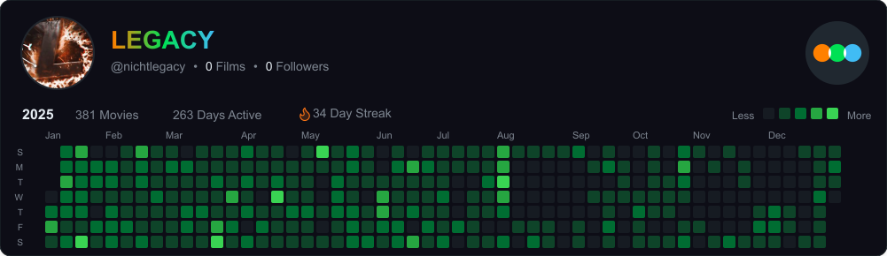
</p>

**`rating`** — colour from the average rating of that day's films. The legend
reads *Low* to *High*, and a quiet day you loved outranks a busy one you did
not.

<p align="center">
  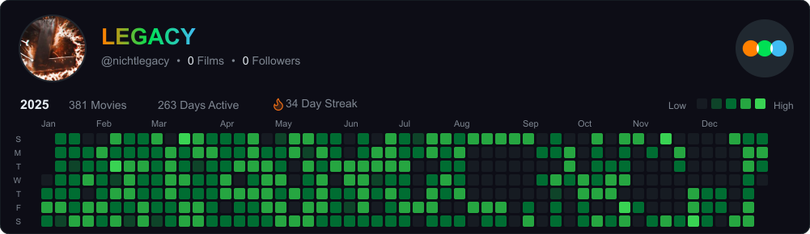
</p>

| Average that day | Step |
|------------------|------|
| under 2.5★ | lowest |
| 2.5★ to 3★ | second |
| 3.5★ to 4★ | third |
| 4.5★ and up | highest |

The average covers the films you rated. An unrated film sharing the day does not
drag it down, and a day where you rated nothing sits on the lowest step — it has
no rating to show, but it is still visibly a day with films on it.

### JSON Export

`images/letterboxd-data.json` holds the same figures the cards use, so a Glance
`custom-api` widget needs no extra backend:

```
https://raw.githubusercontent.com/<github-user>/letterboxd-graph/main/images/letterboxd-data.json
```

<details>
<summary><b>Payload shape</b></summary>

```json
{
  "user": "nichtlegacy",
  "year": 2026,
  "stats": { "films": 123, "daysActive": 80, "streak": 7, "streakFilms": 11, "rewatches": 18, "liked": 19 },
  "cells": [
    {
      "date": "2026-02-16",
      "count": 2,
      "ratingAvg": 3.5,
      "films": [
        { "title": "Film A", "year": "2024", "rating": 3.5, "rewatch": false, "liked": true, "url": "https://letterboxd.com/..." }
      ],
      "url": "https://letterboxd.com/<user>/films/diary/for/2026/02/16/"
    }
  ],
  "recent": [
    { "date": "2026-02-16", "title": "Film A", "year": "2024", "rating": 3.5, "rewatch": false, "liked": true, "url": "https://letterboxd.com/..." }
  ],
  "allTime": {
    "scope": "all",
    "films": 626, "entries": 599, "distinctFilms": 517,
    "firstEntry": "2019-05-05", "lastEntry": "2026-07-30", "spanDays": 2644,
    "daysActive": 427, "rewatches": 83, "liked": 76, "rated": 540, "averageRating": 3.3,
    "perDay": 0.23, "perWeek": 1.6, "perMonth": 6.9,
    "streak": { "length": 34, "startDate": "2025-01-27", "endDate": "2025-03-01", "films": 47 },
    "busiestDay": { "date": "2025-04-16", "count": 5 },
    "longestGap": { "days": 61, "from": "2021-02-03", "to": "2021-04-05" },
    "perYear": [{ "year": 2025, "films": 381, "days": 263 }],
    "perWeekday": [65, 65, 55, 59, 62, 69, 81],
    "perMonthOfYear": [51, 44, 39, 47, 38, 30, 41, 33, 29, 36, 34, 37],
    "monthSeries": [{ "month": "2026-02", "count": 12 }],
    "ratings": [{ "rating": 3.5, "count": 125 }],
    "decades": [{ "decade": 2020, "label": "2020s", "count": 89, "averageRating": 3.5 }],
    "mostRewatched": [{ "title": "Half Baked", "year": "1998", "url": "https://letterboxd.com/...", "views": 5, "averageRating": 4.5 }],
    "milestoneStep": 100,
    "milestones": [{ "n": 100, "kind": "step", "date": "2025-03-08", "title": "Film B", "year": "2004", "rating": 3, "url": "https://letterboxd.com/..." }]
  }
}
```

`stats` and `cells` are scoped to the years in `years`, the same window the graph
draws. `allTime` covers everything the run fetched, which under the default
`scope: all` is the whole diary — `films` is the profile's own count, `entries`
the dated ones. It is aggregates only, so it stays a few kilobytes whatever the
diary weighs, and `scope` says which of the two it was built from.

</details>

### CSV Export

`images/letterboxd-diary.csv` — one row per diary entry, newest first, for
spreadsheets, `q` or any ad-hoc analysis. Same source as the JSON, but flat:

```
https://raw.githubusercontent.com/<github-user>/letterboxd-graph/main/images/letterboxd-diary.csv
```

| Column | Content |
|--------|---------|
| `date` | Watch date `YYYY-MM-DD` (UTC, as Letterboxd stores it) |
| `title` | Film title |
| `year` | Release year |
| `rating` | `0.5`–`5` or empty if unrated |
| `rewatch` | `1` if rewatch, `0` otherwise (flag or repeat-derived) |
| `liked` | `1`/`0` |
| `reviewed` | `1`/`0` |
| `url` | Letterboxd film URL |
| `reviewUrl` | Review URL if the entry carries one |
| `slug` | Film slug (`dune-part-two`) |
| `filmUid` / `lid` | Stable Letterboxd identifiers when present |

Always written alongside the JSON. Header row is included, values are RFC 4180
escaped, UTF-8, LF — opens directly in Excel, Numbers or `pandas.read_csv`.

```bash
# quick check
head images/letterboxd-diary.csv
q "SELECT rating, count(*) FROM 'letterboxd-diary.csv' GROUP BY rating"
```

### Film Cache

Poster, runtime and the community average on the cards all come from the film
page itself (`src/fetcher.js:1018`). Those pages were fetched on every run for
the 20–30 films that make the cards — the same 30 posters every day. The
generator now keeps `images/.film-cache.json` alongside the SVGs: keyed by the
canonical film URL, 30-day TTL, capped at 3000 entries. The cache is committed,
so the next daily run only fetches films it has not seen before. Stale entries
are re-fetched automatically; deleting the file forces a full refresh.

## Embedding

Point at the raw file, not the `blob` URL — GitHub serves `blob` as HTML and the
image will not render. If the image should open with the complete SVG, link it
to the SVG served by your Pages site. GitHub renders README images as ``,
while the Pages deployment serves the SVG with the correct content type.

```html
<a href="https://YOUR_GITHUB_USERNAME.github.io/YOUR_REPOSITORY/images/github-letterboxd-dark.svg">
  <picture>
    <source media="(prefers-color-scheme: dark)"
            srcset="https://raw.githubusercontent.com/YOUR_GITHUB_USERNAME/letterboxd-graph/main/images/github-letterboxd-dark.svg">
    <source media="(prefers-color-scheme: light)"
            srcset="https://raw.githubusercontent.com/YOUR_GITHUB_USERNAME/letterboxd-graph/main/images/github-letterboxd-light.svg">
    
  </picture>
</a>
```

Swap the filename for `letterboxd-review-2026`, `letterboxd-review-current-month`
or `letterboxd-profile` to embed a card instead. Badges are single-file embeds:

```md

```

## Pages Site

A README has room for one card, maybe two, and a card has room for a headline
and ten films. The same files are also published as a page, which has neither
limit — the cards at full size, and the figures behind them read out at length.

<div align="center">

**[letterboxd.nichtlegacy.com](https://letterboxd.nichtlegacy.com/)**

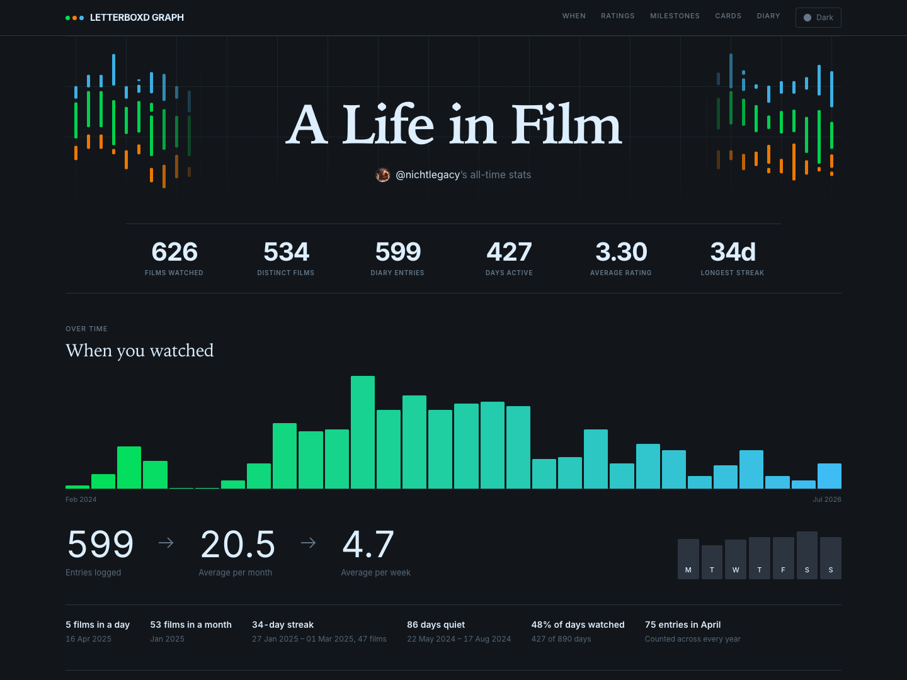

</div>

| Section | What is on it |
|---------|---------------|
| **A Life in Film** | The opening: profile avatar and headline figures, with an All Time/year selector that updates the statistical sections without reloading the page |
| **When you watched** | A column per month for All Time and every Monday–Sunday week for a selected year, empty periods included; weekday distribution, weekly and monthly averages, busiest day, fullest month, longest streak, longest quiet stretch, watched-day share and seasonal pattern — plus a figure per year, written out rather than drawn |
| **On this day** | When the snapshot date has been logged in an earlier year, the films watched on that calendar date, grouped by viewing year and linked back to their diary entries; when there is nothing to remember, the section stays hidden |
| **Breakdown** | Donuts compare films watched in their release year with older titles, first watches with rewatches, and—when reviews exist—reviewed with not reviewed. Counts and percentages stay visible without hover |
| **How you rated** | The half-star histogram, empty steps kept, beside the average, the most given rating and how much is rated or liked at all |
| **What you reached for** | Films by release decade with counts, share and average rating, plus the five you went back to most |
| **Where it turned over** | The first entry, the round numbers after it, and the latest, on one track. `milestoneStep` scales with the diary — every 25th at a hundred entries, every thousandth at five thousand — so the row holds its length instead of growing a marker per hundred |
| **The cards** | Graph, profile, a tab per year, a tab per month — the finished month opens first, tabs cross-fade and the URL updates to `#card-2025` (or `#card-current-month`) so a card can be deep-linked. Each card has **Copy image**, **Copy SVG**, **Copy embed** and **Open SVG**, also available on right click |
| **Recent diary** | The last sixteen entries from the JSON export, newest first, in two columns; rewatches and likes stay marked. The full [Diary](https://letterboxd.nichtlegacy.com/diary.html) is searchable across title, release year, slug and watch date (`diary.html?q=blade+runner` or `?released=1999`) |
| **Use them yourself** | Three short paths: copy a responsive embed, run the action on your own diary, or publish a Pages site like this one. The footer links back to the Letterboxd profile, source and JSON export |

The figures cover whatever the run fetched — the whole diary under `scope: all`,
the graph years under `scope: years`, which the page says out loud rather than
passing narrow numbers off as all-time. Year entries, rating steps, decade rows,
milestones and diary films link back to their matching Letterboxd pages.
Selecting a year writes `?year=2025` into the URL and switches the hero, charts,
breakdowns and milestones. The generated cards and Recent Diary remain the same
snapshot, independent of that statistical view.

The page follows the system theme until switched, then keeps the chosen dark or
light card set. Sticky navigation, smooth section movement and a back-to-top
control keep the long page usable; on a phone the section links become a
horizontal strip. Card embeds load as they scroll into view, and a missing
generated export gets a retryable error state instead of an empty page. For
sharing, the build also writes `og-2025.png`, `og-2024.png` and `og-profile.png`
alongside `og.png` — one 1200×630 PNG per year/profile from the already
committed SVGs.

<details>
<summary><b>Publishing it for your own profile</b></summary>

Which route you take depends on which [Quick Start](#quick-start) you took.

**If you forked this repository**, everything is already in place. Set
`LETTERBOXD_USERNAME` in `.github/workflows/update-graph.yml`, then open
**Settings → Pages** and set **Source** to **GitHub Actions**. Run **Update
Letterboxd Graph + JSON Export** once from the **Actions** tab; the deploy
follows on its own, and the site lands at
`https://<github-user>.github.io/<repository>/`.

For a custom domain, configure it under **Settings → Pages**; the build takes
the deployed address from GitHub automatically.

**If you added the action to a repository of your own**, copy four things
across:

| Copy | Why |
|------|-----|
| `site/` | the page: one HTML file, one stylesheet, one module |
| `scripts/build-site.mjs` | assembles `_site/` and writes the two files the page reads |
| `src/stats.js` | the aggregates behind the figures; the build imports it |
| `fonts/` | Inter as `.woff2`, plus its license |
| `.github/workflows/pages.yml` | builds and deploys on every generator run |

Then:

1. In `pages.yml`, set the `workflows:` list under `workflow_run` to the `name:`
   of your own generator workflow. GitHub matches it by name, not by filename,
   and a name that matches nothing simply never fires. Check `branches:` against
   your default branch while you are in there.
2. Your `package.json` needs `"type": "module"` — `build-site.mjs` imports
   `src/stats.js`, and without it Node reads that file as CommonJS and the build
   dies on the `export` keyword.
3. Keep the `npm ci` step in `pages.yml`. The build uses `sharp` to rasterise
   the Open Graph preview; without it the page still deploys, but its preview
   image is missing.
4. Leave `commit` at its default. The build reads `images/` out of the
   repository and fetches nothing, so the files have to be committed for it to
   have anything to publish.
5. **Settings → Pages → Source → GitHub Actions**, then run the generator once.

A private repository needs a paid plan for Pages; a public one does not.

To preview any of it locally, generate the images once and serve the build:

```bash
npm run build:site     # writes _site/
npm run serve:site     # builds, then serves it on :8080
```

The build only reads `images/`, so previewing costs no requests against
Letterboxd. Deploys can also be triggered by hand from the **Actions** tab,
which is how a branch gets published before it is merged.

</details>

## Requirements

Running through the action needs nothing on your side; the runner provides it
all. For local runs:

| Requirement | Why |
|-------------|-----|
| **Node.js ≥ 22.12** | Required by Puppeteer 25 and `sharp` v0.35 |
| **Python 3 with `curl_cffi`** | The primary fetcher, and needed for the Python tests — `pip install curl_cffi` |
| **A public Letterboxd profile** | Only pages a logged-out visitor can see are read |

Without `curl_cffi` the fetcher falls back to Puppeteer, which is bundled but
markedly slower and more prone to being challenged.

## Development

<details>
<summary><b>Project structure</b></summary>

- [`src/cli.js`](src/cli.js) — argument parsing and the run order
- [`src/fetcher.js`](src/fetcher.js) — diary, profile and film page scraping
- [`src/fetch_with_curl_cffi.py`](src/fetch_with_curl_cffi.py) — primary fetcher, Puppeteer is the fallback
- [`src/generator.js`](src/generator.js) — contribution graph SVG
- [`src/cards.js`](src/cards.js) — review and profile card SVGs
- [`src/badge.js`](src/badge.js) — shields-style badge SVGs
- [`src/film-cache.js`](src/film-cache.js) — persistent film detail cache (`images/.film-cache.json`)
- [`src/svg-utils.js`](src/svg-utils.js) — font subsetting, text measurement, theme colors
- [`src/stats.js`](src/stats.js) — streaks, distributions, JSON export
- [`src/exporter.js`](src/exporter.js) — PNG rasterisation and poster thumbnails
- [`site/`](site/) — the Pages front end: one page, one stylesheet, one module
- [`scripts/build-site.mjs`](scripts/build-site.mjs) — assembles `_site/`, writes the manifest the page reads
- [`action.yml`](action.yml) — the reusable action
- [`tests/`](tests/) — `node:test` for the JavaScript, `unittest` for the fetcher

</details>

```bash
npm test          # both suites
npm run test:js   # statistics, cards and layout
npm run test:py   # the curl_cffi fetcher
```

The layout tests read geometry out of the generated markup rather than asserting
on fixed coordinates, so padding and column changes do not break them
spuriously.

## Contributing

Issues and pull requests are welcome.

- **Bugs** — include the username, the flags or inputs used, and the run log.
  Scraping breaks when Letterboxd changes its markup, and the log usually points
  straight at the selector that stopped matching.
- **Features** — open an issue first if it changes the output. The cards are
  tightly laid out and most additions cost space somewhere else.
- **Pull requests** — run `npm test` first. New behaviour needs a test; layout
  changes should assert on measured geometry, not on coordinates.

## License

Released under the [MIT License](./LICENSE).

Not affiliated with, endorsed by, or connected to Letterboxd. It reads public
profile pages, so it depends on their markup and can break when that changes. Be
considerate with `scope: all` on a large diary — it is one request per 50 entries
against someone else's servers.
