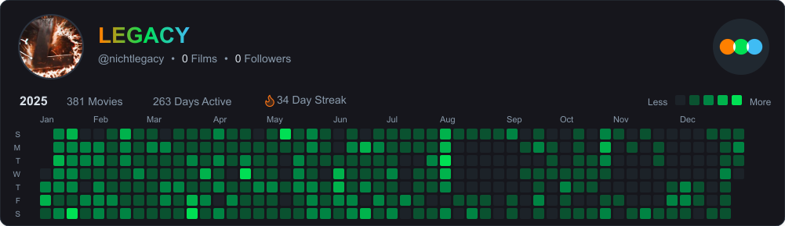

<div align="center">

# Letterboxd Graph

**Turn your Letterboxd diary into a contribution graph and shareable cards.**
Runs as a GitHub Action, commits the finished SVGs back to your repository.

[](https://github.com/nichtlegacy/letterboxd-graph/actions)
[](https://github.com/nichtlegacy/letterboxd-graph/releases)
[](https://nodejs.org/)
[](#quick-start)
[](./LICENSE)

[Quick Start](#quick-start) • [What It Generates](#what-it-generates) • [Configuration](#configuration) • [CLI](#cli) • [How It Works](#how-it-works) • [License](#license)

<a href="https://letterboxd.com/nichtlegacy/">
  <picture>
    <source media="(prefers-color-scheme: dark)" srcset="https://raw.githubusercontent.com/nichtlegacy/letterboxd-graph/main/images/github-letterboxd-dark.svg">
    <source media="(prefers-color-scheme: light)" srcset="https://raw.githubusercontent.com/nichtlegacy/letterboxd-graph/main/images/github-letterboxd-light.svg">
    
  </picture>
</a>

</div>

## Overview

Letterboxd Graph reads a public Letterboxd diary and renders it as SVG: a
GitHub-style activity calendar, a review card per year and per month, and a card
for the profile itself. It also writes a JSON export so you can build your own
widgets from the same figures.

It is meant to be embedded — in a GitHub profile README, a blog post, or a
social preview. Everything is a self-contained SVG with the fonts subset and
inlined, so there is nothing to host and nothing to load at view time.

It needs no Letterboxd account, API key, or server. It reads public profile
pages only, and cannot see anything your profile does not show a logged-out
visitor.

## Quick Start

Add one workflow file to any repository. No fork, no copied scripts.

```yaml
# .github/workflows/letterboxd.yml
name: Update Letterboxd Graph

on:
  schedule:
    - cron: "0 0 * * *"   # daily at midnight UTC
  workflow_dispatch:

permissions:
  contents: write

jobs:
  update-graph:
    runs-on: ubuntu-latest
    steps:
      - uses: actions/checkout@v4

      - uses: nichtlegacy/letterboxd-graph@v2
        with:
          username: YOUR_LETTERBOXD_USERNAME
          years: "2026,2025"        # optional, defaults to the current year
```

Run it once from the **Actions** tab. A healthy first run logs the diary pages
it fetched, then commits into `images/`:

```
Found 599 film entries, 456 in 2026, 2025
   Posters: 10/10, favourites 4/4
   ✓ images/github-letterboxd-dark.svg
   ✓ images/letterboxd-review-2026-dark.svg
   ✓ images/letterboxd-review-current-month-dark.svg
   ✓ images/letterboxd-profile-dark.svg
```

`actions/checkout` is required so the action has a repository to write into. To
handle the files yourself instead of committing them, set `commit: 'false'`.

## What It Generates

Every run writes the same set of files into `images/`, each in a dark and a
light variant. Use `<picture>` so GitHub serves the one matching the reader's
theme — see [Embedding](#embedding).

### Contribution Graph

`github-letterboxd-{dark,light}.svg` — the activity calendar, one block of weeks
per requested year.

<p align="center">
  <picture>
    <source media="(prefers-color-scheme: dark)" srcset="images/github-letterboxd-dark.svg">
    <source media="(prefers-color-scheme: light)" srcset="images/github-letterboxd-light.svg">
    
  </picture>
</p>

Hovering reveals more than the graph shows at rest:

| Hover target | Reveals |
|--------------|---------|
| Year label | Films grouped by release decade |
| Film count | Rating distribution, average rating, rewatch and like totals |
| Days Active | Weekday distribution |
| Day Streak | Date range, film count, and the streak highlighted in the grid |
| Any day cell | The films watched, `↻` for rewatches and `♥` for likes |

<table>
  <tr>
    <th>Day Streak Highlight</th>
    <th>Days Active Tooltip</th>
    <th>Film Count Tooltip</th>
  </tr>
  <tr>
    <td></td>
    <td></td>
    <td></td>
  </tr>
</table>

> [!NOTE]
> GitHub embeds SVGs through an `` tag, which receives no mouse events, and
> serves raw files with a `sandbox` CSP. Hover states and links therefore only
> work when the SVG is opened directly or embedded in a page you control. The
> cell reveal animation is declarative CSS and *does* play inside a README.

### Year in Review

`letterboxd-review-<year>-{dark,light}.svg` — one card per year in `years`.

<p align="center">
  <picture>
    <source media="(prefers-color-scheme: dark)" srcset="images/letterboxd-review-2026-dark.svg">
    <source media="(prefers-color-scheme: light)" srcset="images/letterboxd-review-2026-light.svg">
    
  </picture>
</p>

1200×630, the Open Graph default, so it works as a social preview as it stands.
Headline figures on the left, top rated films on the right with poster art,
runtime and the Letterboxd community rating.

### Month in Review

`letterboxd-review-current-month-{dark,light}.svg` and
`letterboxd-review-previous-month-{dark,light}.svg`.

<p align="center">
  <picture>
    <source media="(prefers-color-scheme: dark)" srcset="images/letterboxd-review-previous-month-dark.svg">
    <source media="(prefers-color-scheme: light)" srcset="images/letterboxd-review-previous-month-light.svg">
    
  </picture>
</p>

The same card narrowed to a single month, shown here for the previous one since
the current month is only a few days old at the start of one. A month with
nothing logged says so rather than rendering an empty list.

The files are named by how recent the month is, not by its date, so an embed
keeps working when the month turns over and old cards do not pile up.

### Profile Card

`letterboxd-profile-{dark,light}.svg` — not tied to a year.

<p align="center">
  <picture>
    <source media="(prefers-color-scheme: dark)" srcset="images/letterboxd-profile-dark.svg">
    <source media="(prefers-color-scheme: light)" srcset="images/letterboxd-profile-light.svg">
    
  </picture>
</p>

The headline is your all-time films watched, taken from the profile page. The
right column shows the favourites pinned on your Letterboxd profile. What the
figures below it cover depends on [Diary Scope](#diary-scope).

### Member Badges

Pro and Patron members get their badge over the avatar, on the graph and on both
cards.

| Status | Badge color | Placement |
|--------|-------------|-----------|
| **Patron** | Cyan `#40bcf4` | Bottom-left of the profile picture |
| **Pro** | Orange `#ff8000` | Bottom-left of the profile picture |

<details>
<summary><b>Patron example</b> — <a href="https://letterboxd.com/BeHaind/">@BeHaind</a></summary>

<p align="center">
  
</p>
<p align="center">
  
</p>

</details>

<details>
<summary><b>Pro example</b> — <a href="https://letterboxd.com/Rufus_Firefly/">@Rufus_Firefly</a></summary>

<p align="center">
  
</p>
<p align="center">
  
</p>

</details>

### JSON Export

`letterboxd-data.json` — every figure the cards use, for building your own
widgets. See [JSON Export](#json-export-1) below.

## Configuration

All options are action inputs. Only `username` is required.

| Input | Description | Default |
|-------|-------------|---------|
| `username` | Letterboxd username (**required**) | – |
| `years` | Comma-separated years, e.g. `2026,2025` | current year |
| `scope` | Diary scope: `all` or `years` | `all` |
| `month-cards` | Recent months to also make cards for, `0` to skip | `2` |
| `mode` | Cell coloring: `count` or `rating` | `count` |
| `palette` | Color palette: `github` or `letterboxd` | `github` |
| `week-start` | `sunday` or `monday` | `sunday` |
| `gradient` | Gradient text: `true`, `false`, `name` or `year` | `true` |
| `animate` | Cell reveal animation | `true` |
| `export-png` | Also write PNG files | `false` |
| `output` | Output path without extension | `images/github-letterboxd` |
| `commit` | Commit and push the generated files | `true` |
| `commit-message` | Commit message (branch and UTC timestamp appended) | `Update Letterboxd graph` |
| `node-version` | Node.js version | `20` |
| `install-browser-deps` | Install Puppeteer system libraries (Ubuntu runners) | `true` |

Outputs `svg-dark`, `svg-light` and `data-json` carry the paths written, for
chaining into an upload or deploy step.

<details>
<summary><b>Alternative: fork and run the CLI directly</b></summary>

To own the whole workflow instead, fork this repository and edit
`.github/workflows/update-graph.yml`. Its `env` block is the configuration:

```yaml
env:
  LETTERBOXD_USERNAME: "YOUR_USERNAME"
  YEARS: "2026,2025"                   # empty for the current year
  SCOPE: "all"                         # "all" (whole diary) or "years"
  MONTH_CARDS: "2"                     # recent months to card, 0 to skip
  WEEK_START: "sunday"                 # "sunday" or "monday"
  GRADIENT: "true"                     # "true", "false", "name" or "year"
  ANIMATE: "true"                      # "false" disables the reveal animation
  PALETTE: "github"                    # "github" or "letterboxd"
  EXPORT_PNG: "false"                  # "true" also writes PNGs
```

This is the path this repository uses itself, except that it calls the action
through `uses: ./` so every scheduled run doubles as an end-to-end test of what
external consumers get.

</details>

## CLI

```bash
npm install
node src/cli.js <username> [options]
```

| Flag | Description | Default |
|------|-------------|---------|
| `-y <years>` | Year(s), comma-separated, e.g. `2026,2025` | current year |
| `-s <scope>` | Diary scope: `all` or `years` | `all` |
| `-c <count>` | Recent months to also card, `0` to skip | `2` |
| `-m <mode>` | Graph mode: `count` or `rating` | `count` |
| `-t <palette>` | Color palette: `github` or `letterboxd` | `github` |
| `-w <day>` | Week start: `sunday` or `monday` | `sunday` |
| `-g <targets>` | Gradient text: `true`, `false`, `name` or `year` | `true` |
| `-a <bool>` | Cell reveal animation | `true` |
| `-p` | Also export PNG files | off |
| `-o <path>` | Output path without extension | `images/github-letterboxd` |

```bash
# Two years, Letterboxd palette
node src/cli.js nichtlegacy -y 2026,2025 -t letterboxd

# Only the requested year, no month cards
node src/cli.js nichtlegacy -y 2025 -s years -c 0

# Rating mode, week starting Monday, plain text, with PNGs
node src/cli.js nichtlegacy -m rating -w monday -g false -p
```

## How It Works

### Diary Scope

By default the complete diary is fetched, so the profile card can report
all-time figures. Paginating it costs one request per 50 entries:

| Profile | Films watched | Diary entries | Requests |
|---------|---------------|---------------|----------|
| [@nichtlegacy](https://letterboxd.com/nichtlegacy/) | 626 | 599 | 12 |
| [@BeHaind](https://letterboxd.com/BeHaind/) | 3,653 | 1,254 | 26 |
| [@Rufus_Firefly](https://letterboxd.com/Rufus_Firefly/) | 5,848 | 3,783 | 76 |

The two counts differ because they measure different things:

- **Films watched** is the profile's own figure, linking to `/<user>/films/`. It
  counts every film marked watched, whether or not it was ever given a date.
- **Diary entries** are dated log entries. Only these carry a rating, a rewatch
  flag or a like, so everything on the cards below the headline comes from them.

@BeHaind has 3,653 films watched against 1,253 distinct films in the diary, so
roughly two thirds were ticked off without a diary entry. Only the diary drives
the request count, which is why a large library can still be cheap to fetch.

> [!NOTE]
> **Rewatches** counts the rewatch flag, the way Letterboxd does — it is set by
> hand, not derived. Logging the same film twice without ticking it leaves the
> count at zero. @BeHaind logged *Leo (2023)* twice and still shows 0 rewatches,
> which is faithful to the diary rather than a parsing miss. Repeat viewings do
> still weigh on the [film ranking](#film-ranking), which counts entries.

The graph and the year cards still only cover the years in `years`; the rest is
filtered out of the same fetch rather than requested again. Set `scope: years`
to fetch only those years — cheaper on a large diary, but it leaves the profile
card scoped to them and labelled with the range.

### Film Ranking

Films on the cards are ranked by rating first. Likes and rewatches only decide
the order *within* a rating:

```
score = rating + 0.30 if liked + 0.08 per extra viewing, capped at 0.16
```

The bonuses total less than a half-star step, so a film can never overtake one
rated higher. This matters more than it sounds: a typical year has a handful of
films at the top rating and a dozen tied one step below, so without it the last
slots would be filled in whatever order the diary returned. Repeat viewings of
one film merge into a single entry at its best rating.

### Color Palettes

Same diary, same year, both palettes:

**`github`** — the familiar contribution graph greens

<p align="center">
  
</p>

**`letterboxd`** — Letterboxd's own UI greys, ramp anchored on its green `#00E054`

<p align="center">
  
</p>

The palette changes the card surfaces too, not just the grid.

The ramp stays single-hue on purpose. Shifting hue across a sequential scale
reads as separate categories rather than as more or less activity, so
Letterboxd's orange and blue stay accents on the streak flame and the badge.

### Graph Modes

**`count`** — intensity from how many films you watched that day, scaled to your
busiest day. The legend reads *Less* to *More*.

<p align="center">
  
</p>

**`rating`** — colour from the average rating of that day's films. The legend
reads *Low* to *High*, and a quiet day you loved outranks a busy one you did
not.

<p align="center">
  
</p>

| Average that day | Step |
|------------------|------|
| under 2.5★ | lowest |
| 2.5★ to 3★ | second |
| 3.5★ to 4★ | third |
| 4.5★ and up | highest |

The average covers the films you rated. An unrated film sharing the day does not
drag it down, and a day where you rated nothing sits on the lowest step — it has
no rating to show, but it is still visibly a day with films on it.

### JSON Export

`images/letterboxd-data.json` holds the same figures the cards use, so a Glance
`custom-api` widget needs no extra backend:

```
https://raw.githubusercontent.com/<github-user>/letterboxd-graph/main/images/letterboxd-data.json
```

<details>
<summary><b>Payload shape</b></summary>

```json
{
  "user": "nichtlegacy",
  "year": 2026,
  "stats": { "films": 123, "daysActive": 80, "streak": 7, "streakFilms": 11, "rewatches": 18, "liked": 19 },
  "cells": [
    {
      "date": "2026-02-16",
      "count": 2,
      "ratingAvg": 3.5,
      "films": [
        { "title": "Film A", "year": "2024", "rating": 3.5, "rewatch": false, "liked": true, "url": "https://letterboxd.com/..." }
      ],
      "url": "https://letterboxd.com/<user>/films/diary/for/2026/02/16/"
    }
  ],
  "recent": [
    { "date": "2026-02-16", "title": "Film A", "year": "2024", "rating": 3.5, "rewatch": false, "liked": true, "url": "https://letterboxd.com/..." }
  ]
}
```

</details>

## Embedding

Point at the raw file, not the `blob` URL — GitHub serves `blob` as HTML and the
image will not render.

```html
<a href="https://letterboxd.com/YOUR_LETTERBOXD_USERNAME/">
  <picture>
    <source media="(prefers-color-scheme: dark)"
            srcset="https://raw.githubusercontent.com/YOUR_GITHUB_USERNAME/letterboxd-graph/main/images/github-letterboxd-dark.svg">
    <source media="(prefers-color-scheme: light)"
            srcset="https://raw.githubusercontent.com/YOUR_GITHUB_USERNAME/letterboxd-graph/main/images/github-letterboxd-light.svg">
    
  </picture>
</a>
```

Swap the filename for `letterboxd-review-2026`, `letterboxd-review-current-month`
or `letterboxd-profile` to embed a card instead.

## Requirements

Running through the action needs nothing on your side; the runner provides it
all. For local runs:

| Requirement | Why |
|-------------|-----|
| **Node.js ≥ 20.9** | Required by `sharp` v0.35, which rasterises the PNG exports |
| **Python 3 with `curl_cffi`** | The primary fetcher, and needed for the Python tests — `pip install curl_cffi` |
| **A public Letterboxd profile** | Only pages a logged-out visitor can see are read |

Without `curl_cffi` the fetcher falls back to Puppeteer, which is bundled but
markedly slower and more prone to being challenged.

## Development

<details>
<summary><b>Project structure</b></summary>

- [`src/cli.js`](src/cli.js) — argument parsing and the run order
- [`src/fetcher.js`](src/fetcher.js) — diary, profile and film page scraping
- [`src/fetch_with_curl_cffi.py`](src/fetch_with_curl_cffi.py) — primary fetcher, Puppeteer is the fallback
- [`src/generator.js`](src/generator.js) — contribution graph SVG
- [`src/cards.js`](src/cards.js) — review and profile card SVGs
- [`src/svg-utils.js`](src/svg-utils.js) — font subsetting, text measurement, palettes
- [`src/stats.js`](src/stats.js) — streaks, distributions, JSON export
- [`src/exporter.js`](src/exporter.js) — PNG rasterisation and poster thumbnails
- [`action.yml`](action.yml) — the reusable action
- [`tests/`](tests/) — `node:test` for the JavaScript, `unittest` for the fetcher

</details>

```bash
npm test          # both suites
npm run test:js   # statistics, cards and layout
npm run test:py   # the curl_cffi fetcher
```

The layout tests read geometry out of the generated markup rather than asserting
on fixed coordinates, so padding and column changes do not break them
spuriously.

## Contributing

Issues and pull requests are welcome.

- **Bugs** — include the username, the flags or inputs used, and the run log.
  Scraping breaks when Letterboxd changes its markup, and the log usually points
  straight at the selector that stopped matching.
- **Features** — open an issue first if it changes the output. The cards are
  tightly laid out and most additions cost space somewhere else.
- **Pull requests** — run `npm test` first. New behaviour needs a test; layout
  changes should assert on measured geometry, not on coordinates.

## License

Released under the [MIT License](./LICENSE).

Not affiliated with, endorsed by, or connected to Letterboxd. It reads public
profile pages, so it depends on their markup and can break when that changes. Be
considerate with `scope: all` on a large diary — it is one request per 50 entries
against someone else's servers.
