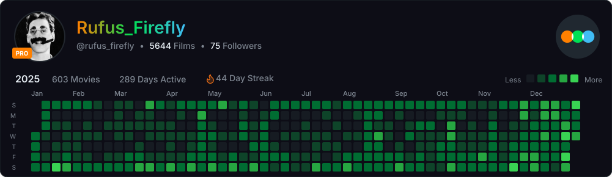
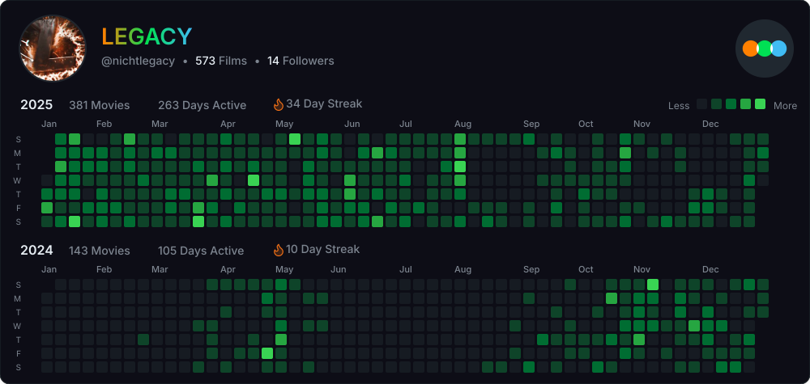

# 🎬 Letterboxd Contribution Graph

<p align="center">
  
  
  
  
  
</p>

<p align="center">
  <strong>Transform your Letterboxd film diary into a beautiful GitHub-style contribution graph</strong>
</p>

<p align="center">
  <a href="https://letterboxd.com/nichtlegacy/" target="_blank">
    <picture>
      <source media="(prefers-color-scheme: dark)" srcset="https://github.com/nichtlegacy/letterboxd-graph/blob/main/images/github-letterboxd-dark.svg">
      <source media="(prefers-color-scheme: light)" srcset="https://github.com/nichtlegacy/letterboxd-graph/blob/main/images/github-letterboxd-light.svg">
      
    </picture>
  </a>
</p>

---

## ✨ Features

| Feature | Description |
|---------|-------------|
| 🎨 **Light & Dark Themes** | Automatically adapts to GitHub's theme preference |
| 📊 **Activity Heatmap** | GitHub-style contribution graph showing film activity |
| 👤 **Profile Integration** | Shows profile picture, display name, stats, and member badge |
| 🏆 **Pro/Patron Badges** | Displays Letterboxd Pro (orange) or Patron (cyan) status |
| 📅 **Multi-Year Support** | Generate graphs spanning multiple years |
| 🎯 **Streak Highlighting** | Hover over "Day Streak" to highlight your longest streak, with its date range and film count |
| 💬 **Interactive Tooltips** | Hover over cells to see film details (in browser) |
| 📈 **Rating Distribution + Summary** | Hover over the film count for the rating histogram, your average rating, and rewatch/like totals |
| ↻ **Rewatches & Likes** | Rewatched entries are marked `↻` and liked entries `♥` in the day tooltips |
| 🕰️ **Decade Breakdown** | Hover over the year label to see how your films spread across release decades |
| ✨ **Cell Reveal Animation** | Cells fade in as a wave when the SVG loads; respects `prefers-reduced-motion` |
| 🎨 **Color Palettes** | GitHub green, or a Letterboxd-native palette built on its signature green |
| ⭐ **Rating Mode** | Color cells by average rating instead of watch count |
| 📦 **JSON Export** | Writes `images/letterboxd-data.json` for external widgets (e.g. Glance `custom-api`) |
| 🔄 **Daily Updates** | Automated updates via GitHub Actions |

---

## 🚀 Quick Start

### 1. Fork this Repository

Click the **Fork** button at the top-right of this page.

### 2. Update Your Username

Edit `.github/workflows/update-graph.yml`:

```yaml
- run: npm start YOUR_LETTERBOXD_USERNAME -o images/github-letterboxd
```

### 3. Enable GitHub Actions

Go to **Actions** tab → Enable workflows if prompted.

### 4. Run the Workflow

The graph updates daily at midnight UTC, or trigger manually via the **Actions** tab.

---

## 📸 Examples

### Patron User (Single Year)
<p align="center">
  
</p>

### Pro User (Single Year)
<p align="center">
  
</p>

### Multi-Year Graph
<p align="center">
  
</p>

### Interactive Features

Hover over stats to reveal additional information:

- **Year label** → films grouped by release decade
- **Film count** → rating distribution, average rating, rewatch and like totals
- **Days Active** → weekday distribution
- **Day Streak** → date range, film count, and the streak highlighted in the grid
- **Any day cell** → the films watched, with `↻` for rewatches and `♥` for likes

> **Note:** GitHub embeds the SVG through an `` tag, which cannot receive mouse
> events — hover states only work when you open the SVG file directly in a browser.
> The cell reveal animation is declarative CSS and *does* play inside a README.

<table>
  <tr>
    <th>Day Streak Highlight</th>
    <th>Days Active Tooltip</th>
    <th>Film Count Tooltip</th>
  </tr>
  <tr>
    <td></td>
    <td></td>
    <td></td>
  </tr>
</table>

---

## 📖 CLI Usage

```bash
# Install dependencies
npm install

# Basic usage
node src/cli.js <username>

# With options
node src/cli.js <username> [options]
```

### Arguments

| Flag | Description | Default |
|------|-------------|---------|
| `-y <years>` | Year(s) to generate, comma-separated (e.g. `2024,2023`) | Current year |
| `-w <day>` | Week start: `sunday` or `monday` | `sunday` |
| `-o <path>` | Output path (without extension) | `images/github-letterboxd` |
| `-g <bool>` | Enable username gradient: `true` or `false` | `true` |
| `-p` | Export PNG files in addition to SVG | Disabled |
| `-m <mode>` | Graph mode: `count` or `rating` | `count` |
| `-a <bool>` | Cell reveal animation: `true` or `false` | `true` |
| `-t <palette>` | Color palette: `github` or `letterboxd` | `github` |

### Examples

```bash
# Single year with custom output
node src/cli.js nichtlegacy -y 2025 -o images/my-graph

# Multiple years (2024 + 2025)
node src/cli.js nichtlegacy -y 2025,2024

# Start week on Monday, no gradient
node src/cli.js nichtlegacy -w monday -g false

# Rating mode with PNG export
node src/cli.js nichtlegacy -m rating -p
```

---

## 🔧 GitHub Actions Setup

### Option A: Reusable Action (recommended)

You don't need to fork or copy this repository. Add a single workflow file to any repo
(for example your GitHub profile repo) and pass your username as an input:

```yaml
name: Update Letterboxd Graph

on:
  schedule:
    - cron: "0 0 * * *"   # Daily at midnight UTC
  workflow_dispatch:

permissions:
  contents: write

jobs:
  update-graph:
    runs-on: ubuntu-latest
    steps:
      - uses: actions/checkout@v4

      - uses: nichtlegacy/letterboxd-graph@v2
        with:
          username: YOUR_LETTERBOXD_USERNAME
          years: "2026,2025"        # optional, defaults to the current year
```

The action generates the SVGs plus `letterboxd-data.json` and commits them back to the
checked-out branch. `actions/checkout` is required so the action has a repository to
write into.

#### Action Inputs

| Input | Description | Default |
|-------|-------------|---------|
| `username` | Letterboxd username (**required**) | – |
| `years` | Comma-separated years, e.g. `2026,2025` | current year |
| `week-start` | `sunday` or `monday` | `sunday` |
| `mode` | `count` or `rating` | `count` |
| `gradient` | Letterboxd color gradient on the display name | `true` |
| `animate` | Cell reveal animation | `true` |
| `palette` | Color palette: `github` or `letterboxd` | `github` |
| `export-png` | Also write PNG files | `false` |
| `output` | Output path without extension | `images/github-letterboxd` |
| `node-version` | Node.js version | `20` |
| `install-browser-deps` | Install Puppeteer system libraries (Ubuntu runners) | `true` |
| `commit` | Commit and push the generated files | `true` |
| `commit-message` | Commit message (branch + UTC timestamp appended) | `Update Letterboxd graph` |

#### Action Outputs

| Output | Description |
|--------|-------------|
| `svg-dark` | Path to the dark theme SVG |
| `svg-light` | Path to the light theme SVG |
| `data-json` | Path to the JSON export |

Set `commit: 'false'` if you want to handle the files yourself, for example to upload
them as an artifact or deploy them to GitHub Pages.

### Option B: Copy the Workflow

If you'd rather fork this repository and run the CLI directly:

#### Workflow File

Create `.github/workflows/update-graph.yml`:

```yaml
name: Update Letterboxd Graph

# ╔════════════════════════════════════════════════════════════════╗
# ║  CONFIGURATION - Edit these values for your Letterboxd profile ║
# ╚════════════════════════════════════════════════════════════════╝
env:
  LETTERBOXD_USERNAME: "YOUR_USERNAME" # Replace with your username
  YEARS: ""                            # e.g. "2025,2024" or leave empty for current year
  EXPORT_PNG: "false"                  # Set to "true" to also generate PNG files
  WEEK_START: "sunday"                 # "sunday" or "monday"
  GRADIENT: "true"                     # "true" for colored name, "false" for white
  ANIMATE: "true"                      # "false" to disable the cell reveal animation
  PALETTE: "github"                    # "github" or "letterboxd"

on:
  schedule:
    - cron: "0 0 * * *"   # Daily at midnight UTC
  workflow_dispatch:       # Manual trigger

permissions:
  contents: write

jobs:
  update-graph:
    runs-on: ubuntu-latest
    steps:
      - uses: actions/checkout@v4
      
      - uses: actions/setup-node@v4
        with:
          node-version: '20'
          cache: 'npm'
      
      - run: npm ci
      
      - name: Generate Graph
        run: |
          # Build command based on configuration
          CMD="node src/cli.js ${{ env.LETTERBOXD_USERNAME }} -o images/github-letterboxd"
          
          if [ -n "${{ env.YEARS }}" ]; then CMD="$CMD -y ${{ env.YEARS }}"; fi
          if [ "${{ env.WEEK_START }}" = "monday" ]; then CMD="$CMD -w monday"; fi
          if [ "${{ env.GRADIENT }}" = "false" ]; then CMD="$CMD -g false"; fi
          if [ "${{ env.ANIMATE }}" = "false" ]; then CMD="$CMD -a false"; fi
          if [ -n "${{ env.PALETTE }}" ]; then CMD="$CMD -t ${{ env.PALETTE }}"; fi
          if [ "${{ env.EXPORT_PNG }}" = "true" ]; then CMD="$CMD -p"; fi
          
          echo "Running: $CMD"
          eval $CMD

      - name: Commit and Push
        run: |
          git config --global user.name 'github-actions[bot]'
          git config --global user.email 'github-actions[bot]@users.noreply.github.com'
          git add images/
          
          if git diff --staged --quiet; then
            echo "No changes to commit"
          else
            git commit -m "Update Letterboxd graph"
            git push
          fi
```

### Configuration

You can customize the graph directly in the workflow file by editing the `env` section at the top:

- **LETTERBOXD_USERNAME**: Your Letterboxd profile name
- **YEARS**: Comma-separated list of years (e.g., `2025,2024`)
- **EXPORT_PNG**: Set to `true` if you want PNG versions alongside SVGs
- **WEEK_START**: Start week on `sunday` or `monday`
- **GRADIENT**: Toggle the username text gradient
- **ANIMATE**: Toggle the cell reveal animation
- **PALETTE**: Heatmap colors, `github` or `letterboxd`

---


### Glance Widgets (custom-api)

The generator also writes `images/letterboxd-data.json`, so you can build Glance widgets without running an extra backend container.

Raw URL format:

```
https://raw.githubusercontent.com/<github-user>/letterboxd-graph/main/images/letterboxd-data.json
```

Example payload shape:

```json
{
  "user": "nichtlegacy",
  "year": 2026,
  "stats": { "films": 123, "daysActive": 80, "streak": 7, "streakFilms": 11, "rewatches": 18, "liked": 19 },
  "cells": [
    {
      "date": "2026-02-16",
      "count": 2,
      "ratingAvg": 3.5,
      "films": [
        { "title": "Film A", "year": "2024", "rating": 3.5, "rewatch": false, "liked": true, "url": "https://letterboxd.com/..." }
      ],
      "url": "https://letterboxd.com/<user>/films/diary/for/2026/02/16/"
    }
  ],
  "recent": [
    { "date": "2026-02-16", "title": "Film A", "year": "2024", "rating": 3.5, "rewatch": false, "liked": true, "url": "https://letterboxd.com/..." }
  ]
}
```

You can use this to build:

- a compact heatmap widget (GitHub-like)
- a separate stats widget (`films`, `daysActive`, `streak`, `streakFilms`, `rewatches`, `liked`)
- an optional recent-watches list

## 📂 Project Structure

```
letterboxd-graph/
├── action.yml                # Reusable GitHub Action definition
├── .github/
│   ├── assets/               # README images and examples
│   └── workflows/
│       └── update-graph.yml  # GitHub Actions workflow
├── fonts/
│   ├── Inter-Bold.ttf
│   ├── Inter-Medium.ttf
│   ├── Inter-Regular.ttf
│   └── Inter-SemiBold.ttf    # Primary font for text measurement
├── images/
│   ├── github-letterboxd-dark.svg    # Generated dark theme
│   ├── github-letterboxd-light.svg   # Generated light theme
│   └── letterboxd-data.json          # Generated JSON data for widgets
├── src/
│   ├── cli.js                # CLI entry point
│   ├── fetcher.js            # Letterboxd data fetching
│   ├── fetch_with_curl_cffi.py  # curl_cffi fetcher (primary, Puppeteer is the fallback)
│   ├── generator.js          # SVG generation
│   ├── stats.js              # Statistics calculations
│   └── exporter.js           # PNG export functionality
├── tests/
│   ├── stats.test.js                 # Tests for the statistics helpers
│   └── test_fetch_with_curl_cffi.py  # Tests for the curl_cffi fetcher
├── package.json
└── README.md
```

Run the test suite with:

```bash
npm test          # JavaScript and Python tests
npm run test:js   # node:test suite for src/stats.js
npm run test:py   # unittest suite for the curl_cffi fetcher
```

---

## 🖼️ Embed in Your README

Add this to your profile README to display the graph with automatic theme switching:

```html
<p align="center">
  <a href="https://letterboxd.com/YOUR_LETTERBOXD_USERNAME/" target="_blank">
    <picture>
      <source
        media="(prefers-color-scheme: dark)"
        srcset="https://github.com/YOUR_GITHUB_USERNAME/letterboxd-graph/blob/main/images/github-letterboxd-dark.svg"
      />
      <source
        media="(prefers-color-scheme: light)"
        srcset="https://github.com/YOUR_GITHUB_USERNAME/letterboxd-graph/blob/main/images/github-letterboxd-light.svg"
      />
      
    </picture>
  </a>
</p>
```

Replace `YOUR_GITHUB_USERNAME` and `YOUR_LETTERBOXD_USERNAME` with your usernames.

---

## 🎨 Themes & Modes

### Color Palettes

| Palette | Description |
|---------|-------------|
| **github** (default) | The familiar GitHub contribution graph greens |
| **letterboxd** | Letterboxd's own UI greys with a ramp anchored on its signature green `#00E054` |

The ramp stays single-hue on purpose. Shifting hue across a sequential scale
reads as separate categories rather than as more or less activity, so
Letterboxd's orange and blue keep their existing roles as accents on the streak
flame and the member badge.

### Graph Modes

| Mode | Description |
|------|-------------|
| **Count** (default) | Cell color intensity based on number of films watched |
| **Rating** | Cell color based on average rating of films that day |

### Member Badges

The graph automatically detects and displays your Letterboxd membership status:

| Status | Badge Color | Location |
|--------|-------------|----------|
| **Pro** | Orange (#ff8000) | Bottom-left of profile picture |
| **Patron** | Cyan (#40bcf4) | Bottom-left of profile picture |

---

## 🛠️ Requirements

- **Node.js** v20.9 or higher (required by sharp v0.35)
- **Python 3** with `curl_cffi` (`pip install curl_cffi`) — used as the primary fetcher and to run the tests. Without it the fetcher falls back to Puppeteer.
- **Public Letterboxd profile** with diary entries
- **GitHub account** with Actions enabled (for automated updates)

---

## 🤝 Contributing

Contributions are welcome! Feel free to:

- 🐛 Report bugs
- 💡 Suggest features
- 🔧 Submit pull requests

---

## 📄 License

MIT License - see [LICENSE](LICENSE) for details.
